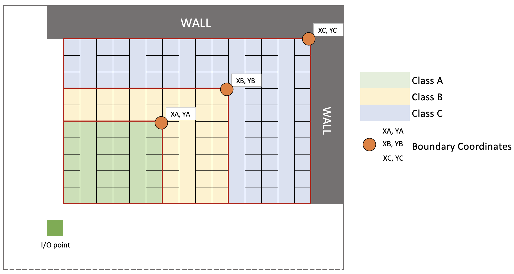

# FYP - Slotting Strategy

This project studies different slotting strategy (class based strategy and random storage) using object-oriented discrete event simulation. 

#### How to change warehouse dimension?

Default warehouse layout is 10 rows x 10 cols x 10 layers. 

It can be updated in `program.cs: MySimModel`

``` c#
storage = new Storage(10,10,10,1,1,5,5,10,10,isClassBased); // Create new storage  
```

The first three arguements are indicating row, col, and layer respectively.


#### How to simulate Class Based Strategy/Random Strategy?

In `program.cs: MySimModel`, look for `isClassBased`variable. 

+ By setting it to true, the system will simulate class based strategy.

  ``` c#
  public bool isClassBased=true;     
  ```

+ Otherwise, the system will simulate Random Strategy

  ``` c#
  public bool isClassBased=false;     
  ```

#### How to change the size of classes for Class Based Strategy?

By default, there are three classes: A, B, C. This cannot be altered. 

Class A has the highest popularity, class C has the lowest popularity.

The dedicated storage zone for each class can be changed.

In `program.cs: MySimModel`

``` c#
storage = new Storage(10,10,10,1,1,5,5,10,10,isClassBased); // Create new storage  
```

The last six arguements are indicating class A, B, C's boundary.

